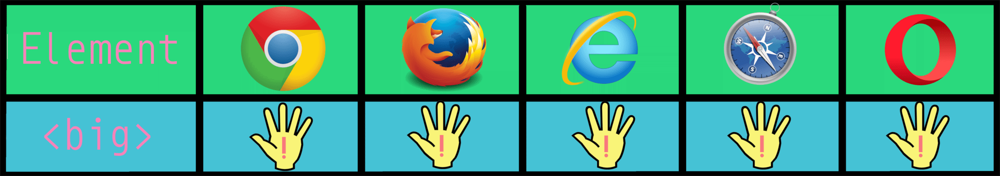

---
#big

##Type

HTML tag

---
##Current Status

Depreciated

This element is not supported in HTML5.

---
##Browser Support

Supported by all major browsers but removed from the HTML specification.

---
##In Use

	<big>Add Text Here</big>
	
	<big><big>More text here</big></big>

---
###Related Technologies

####The font size attribute

Previous to HTML5 font size could be specified by a value of 1 -7.

Example:

	This is some text!

Using the big tag would increase the font size by one, such as from font-size 4 to font-size 5.  The font-size attribute has been removed from the HTML5 specification and the big tag was removed with it.

---
###Simple Example

	This is text.
	
	<big>This is bigger text.</big>
	

This is text.

<big>This is bigger text.</big>

---
###Complex Example

Multiple big tags can be increased to additional effect.

	<big>This a big text</big>
	
	This is normal text
	
	<big><big>This is even bigger text</big></big>

<big>This a big text</big>

This is normal text

<big><big>This is even bigger text</big></big>

